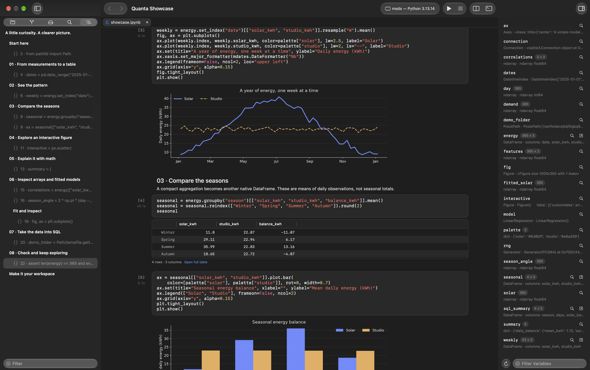
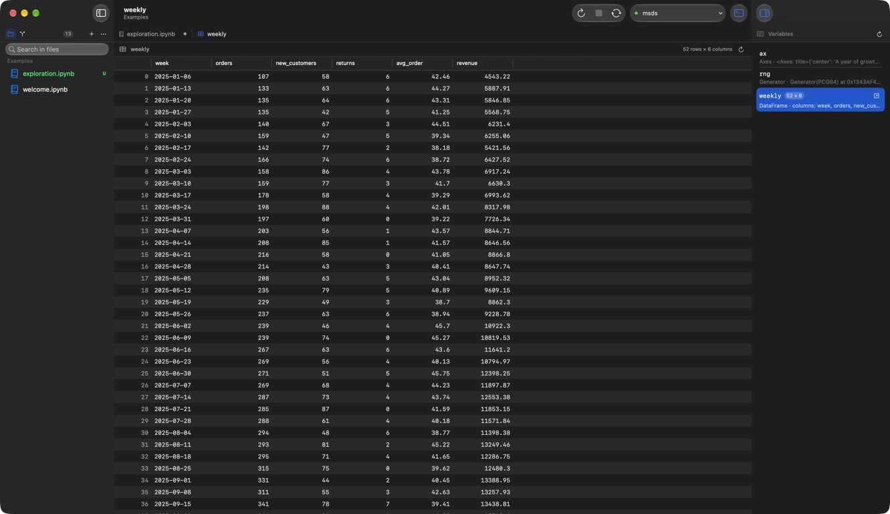

<h1 align="center">Quanta</h1>

<p align="center">A native workspace for Python and Jupyter notebooks on macOS.</p>
<p align="center"><sub>SwiftUI + AppKit · macOS 15+ · MIT licensed</sub></p>



## Explore, run, understand

- **Notebooks and scripts** — edit `.ipynb` and `.py` files with syntax highlighting, keyboard shortcuts, and a shared Python session.
- **Data you can inspect** — native DataFrame tables, a variable explorer, and an interactive console.
- **Plots beside your code** — inline matplotlib charts and interactive Plotly figures, plus a Plots tab beside Console and Terminal with thumbnails, export controls, and source navigation.
- **Git built in** — review diffs, stage changes, and commit. Notebook diffs focus on source, so rerunning cells stays out of the way.



## Get started

Build from source with **Xcode 26+**, **macOS 15+**, and **Python 3**:

```sh
git clone https://github.com/hashemwa/quanta-ide.git
cd quanta-ide
./scripts/quanta run
```

Or open `Quanta.xcodeproj` in Xcode and run the **Quanta** scheme.

Quanta discovers local Python environments automatically. Select yours in the toolbar.
New workspaces open in restricted mode until you choose **Trust and Enable Python**.
You can browse and edit without trusting a folder; Python version probes, execution,
and kernel-backed previews remain disabled. Trust is remembered for that exact folder.
Use **Run → Trust Workspace…** to enable Python later.

Switching projects or interpreters asks before replacing a running Python session.
Choose **Restart in Workspace** to clear variables and use the new directory, or
**Keep Current Session** to retain its variables and directory. The interpreter menu
shows the session's interpreter and directory, including directory changes reported
after running code.

For the sample notebook, install these packages in that environment:

```sh
python -m pip install numpy pandas matplotlib
```

Open `Examples/exploration.ipynb` and press **⌘R** to run it. The example uses synthetic data.
The Python bridge itself needs only the standard library. See [Notebook compatibility](docs/notebook-compatibility.md)
for supported commands and current output limitations.

| Shortcut | Action |
| :--- | :--- |
| ⌘↩ | Run cell |
| ⇧↩ | Run cell and advance |
| ⌘R | Run notebook or script |
| ⌘. | Interrupt execution |

The Plots panel defaults to the active file. Choose **All Files and Console** to browse
other figures. It retains up to 200 plots during the app session, including earlier
runs; notebook outputs remain inline and are saved independently. Script figures appear
in the panel rather than opening external image files. Use **Navigate → Show Plots** or the
command palette to open it.

## Contribute

Bug reports and focused pull requests are welcome. See [Contributing](CONTRIBUTING.md)
for the project conventions and [Development](docs/development.md) for architecture,
building, and release packaging.

```sh
./scripts/quanta test
```

[MIT License](LICENSE)
