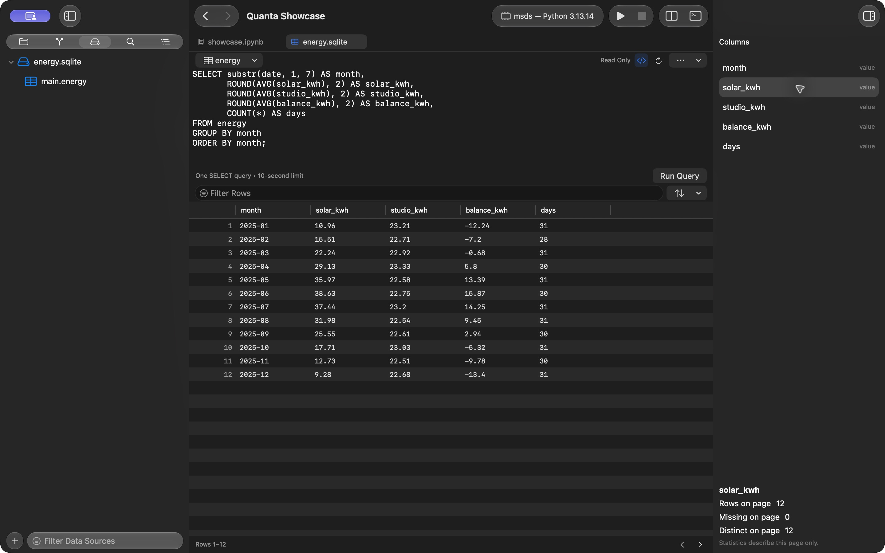
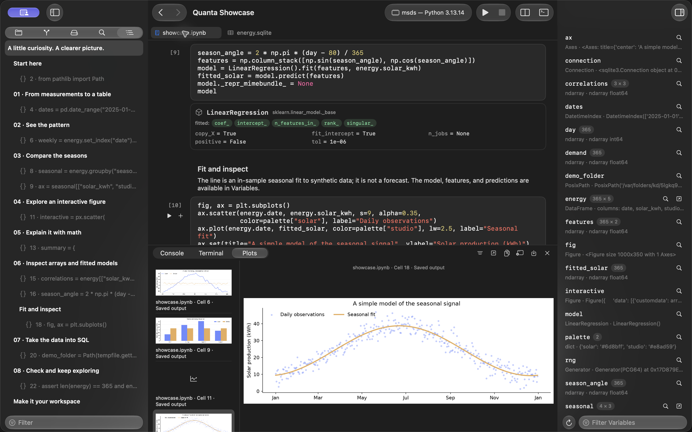

<h1 align="center">Quanta</h1>

<p align="center">A native workspace for Python and Jupyter notebooks on macOS.</p>
<p align="center"><sub>SwiftUI + AppKit · macOS 15+ · MIT licensed</sub></p>
<p align="center">
  <a href="#get-started">Get started</a> ·
  <a href="Examples/showcase.ipynb">Example notebook</a> ·
  <a href="https://github.com/hashemwa/quanta-ide/releases">Releases</a> ·
  <a href="docs/notebook-compatibility.md">Notebook compatibility</a>
</p>


## Explore, run, understand

- **Notebooks and scripts** — edit `.ipynb` and `.py` files with syntax highlighting, live completions, and a shared Python session.
- **Find your place** — jump between notebook headings and cells with Outline, and use cell controls to insert, move, duplicate, or collapse cells.
- **Inspect your results** — explore native DataFrame tables, NumPy array previews, JSON trees, and model cards alongside your code.
- **Keep your plots close** — view inline matplotlib charts and interactive Plotly figures, then revisit and export them from the Plots panel.
- **Browse local data** — open SQLite, DuckDB, CSV, TSV, and Parquet sources, inspect columns, and run read-only SQL without starting Python.
- **Review and share** — review source-focused notebook diffs with built-in Git, or export notebooks as Python, HTML, and PDF.

## Get started

Build from source with **Xcode 26+**, **macOS 15+**, and **Python 3**:

```sh
git clone https://github.com/hashemwa/quanta-ide.git
cd quanta-ide
./scripts/quanta run
```

Or open `Quanta.xcodeproj` in Xcode and run the **Quanta** scheme.

Quanta discovers local Python environments automatically. Select yours in the toolbar,
then choose **Trust and Enable Python** when you're ready to run code. New workspaces
start in restricted mode: you can browse and edit, but Python execution, interpreter
probes, and kernel-backed previews stay disabled. Trust applies to that exact folder;
use **Run → Trust Workspace…** to enable it later.

### Try the showcase

Install the example's packages in your selected Python environment:

```sh
python -m pip install numpy pandas matplotlib plotly scikit-learn
```

Open [Examples/showcase.ipynb](Examples/showcase.ipynb) and press **⌘R**. Follow a
fictional solar-powered studio from daily measurements to tables, charts, equations,
array previews, and a fitted model. The notebook generates synthetic data locally
with a fixed seed and creates sample CSV and SQLite files in a temporary folder.
After installing the packages, it runs without network access.

For a smaller example using only NumPy, pandas, and matplotlib, try
[Examples/exploration.ipynb](Examples/exploration.ipynb).

Quanta's Python bridge needs only the standard library. It supports ordinary Python,
but does not run an IPython or Jupyter kernel; most magics, shell escapes, and
interactive Jupyter widgets are unsupported. See
[Notebook compatibility](docs/notebook-compatibility.md) for details.

## From files to answers



Use **Data → Open Data Source…** to open a local database or data file. **⌘3** opens
the Data navigator. Tables appear in editor tabs with filtering, sorting, and a
column inspector; the SQL button opens a read-only query editor.

Export a result page as CSV, or choose **Data Actions → Open Loading Code in Notebook**
to create reproducible Python loading code. Pages contain up to 200 rows, and
inspector statistics describe the current page. Queries have a Stop action, a
10-second limit, and a 4 MB result-page budget; DuckDB also has a 128 MB memory limit.
See [Data browser development](docs/data-browser.md) for supported sources and limits.

## Inspect models and revisit plots



Choose **Navigate → Show Plots** to open the gallery beside Console and Terminal.
It defaults to the active file; choose **All Files and Console** to include other
figures. Use its controls to export a plot or jump to its source.

The gallery retains up to 200 plots during the app session, including earlier runs.
Notebook outputs stay inline and save independently. Script figures appear in the
panel as well.

## Make it your workspace

| Shortcut | Action |
| :--- | :--- |
| ⌘↩ | Run cell |
| ⇧↩ | Run cell and advance |
| ⌘R | Run notebook or script |
| ⌘. | Interrupt execution |
| ⌘5 | Show notebook Outline |
| ⌘3 | Show Data navigator |
| ⌃Space | Show completions |
| ⇧Tab | Show documentation or call signature |

**Navigate and edit.** Use Outline to filter and jump between headings and cells.
Select a cell to reveal its floating controls, or open its context menu for more
actions. The **+** menu inserts Code or Markdown above or below. Press **Esc** for
command mode, then **A** / **B** to insert code above or below, or **M** / **Y** to
change the cell type.

**Work with live state.** The notebook, Variables inspector, and interactive console
share one Python session. Completions and parameter help use that session too.
Switching projects or interpreters asks before replacing a running session:
**Restart in Workspace** clears variables and uses the new directory;
**Keep Current Session** retains its variables and directory. The interpreter menu
shows the session's interpreter and working directory.

**Copy your data.** DataFrame context menus distinguish formatted **Previews** from
**Original Values**. Original values preserve full strings, newlines, and numeric
precision for the captured snapshot; column copying covers loaded rows only.

**Share a notebook.** Use **File → Export Notebook** for Python, HTML, or PDF.
HTML includes offline math, Markdown tables, full text outputs, and interactive
Plotly figures. PDF export paginates the notebook and waits for figures to render.

**Review changes.** Built-in Git supports diffs, staging, and commits. Notebook
diffs focus on source, so rerunning cells stays out of the way.

## Contribute

Bug reports and focused pull requests are welcome. See [Contributing](CONTRIBUTING.md)
for the project conventions and [Development](docs/development.md) for architecture,
building, and release packaging.

```sh
./scripts/quanta test
```

[MIT License](LICENSE)
