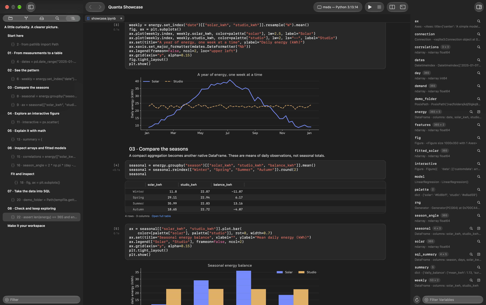

# Quanta

A native Python and Jupyter notebook editor for macOS, built with SwiftUI and AppKit.



- Edit notebooks and scripts with source-name suggestions, live completions, and a shared Python console.
- Connect GitHub Copilot for native inline suggestions, with account, pause, and project controls.
- Catch syntax mistakes in a native Problems panel; add Ruff for lint checks and undoable formatting.
- Create a workspace environment and install packages through the Python Environment window.
- Inspect DataFrames, arrays, and models; view matplotlib and interactive Plotly charts.
- Browse local databases and data files with read-only SQL.
- Review changes with built-in Git and export notebooks to Python, HTML, or PDF.

## Download

[Download Quanta for Apple Silicon](https://github.com/hashemwa/quanta-ide/releases/download/v1.2/Quanta-1.2.dmg).
Requires **macOS 27+** and a local **Python 3** installation.

Open the DMG and drag Quanta to Applications. Select a Python environment in the
toolbar and choose **Trust and Enable Python** to run code in your workspace.

## Build from source

Building also requires **Xcode 27+**.

```sh
git clone https://github.com/hashemwa/quanta-ide.git
cd quanta-ide
./scripts/quanta run
```

You can also open `Quanta.xcodeproj` in Xcode and run the **Quanta** scheme.

## Example

Open **Run → Python Environment…** to create a workspace `.venv`, inspect installed
packages, or install packages in the selected interpreter. Add `ruff` there to enable
**Run → Format Code** (⇧⌥F) and additional code checks. Syntax checks need no extra package.

For the example notebook, install these packages in your selected environment:

```sh
python -m pip install numpy pandas matplotlib plotly scikit-learn
```

Open [Examples/showcase.ipynb](Examples/showcase.ipynb) and press **⌘R**.
It uses locally generated synthetic data to demonstrate tables, plots, math,
model inspection, and SQLite export.

Quanta uses its own Python bridge. Most IPython magics, shell escapes, and
Jupyter widgets are unsupported; see [notebook compatibility](docs/notebook-compatibility.md).

## Documentation

- [Releases](https://github.com/hashemwa/quanta-ide/releases)
- [Development and release packaging](docs/development.md)
- [Data browser](docs/data-browser.md)
- [Python code checks and completion](docs/language-intelligence.md)
- [Contributing](CONTRIBUTING.md)

[MIT License](LICENSE)
